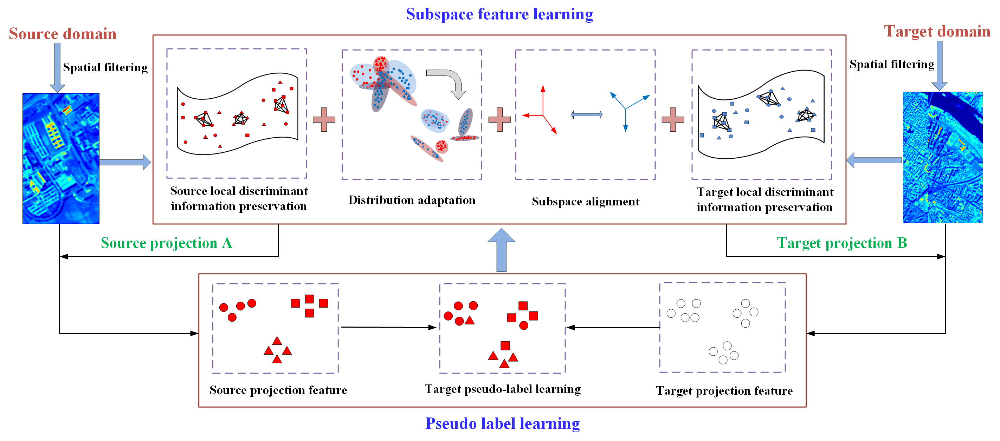

# GEDA
Graph Embedding and Distribution Adaptation for Domain Adaptation in Hyperspectral Image Classification

Paper web page: [Graph Embedding and Distribution Adaptation for Domain Adaptation in Hyperspectral Image Classification][(https://ieeexplore.ieee.org/document/9496229].

Paper web page: [Two-Branch Attention Adversarial Domain Adaptation Network for Hyperspectral Image Classification]([(https://ieeexplore.ieee.org/document/9924236]).

  

# Abstract

Recent studies have shown that the discriminant information of both source domain and target domain is very important in cross-domain classification problems. Based on it, we propose a new domain adaptation (DA) method for hyperspectral image (HSI) classification — GEDA (graph embedding and distribution adaptation, GEDA mainly aims at the following points: 1) Global information and local discriminant information of source domain and target domain; 2) The distribution difference between the source domain and the target domain and the distance of the subspace; 3) Features of hyperspectral images. GEDA makes full use of the discriminant information of source domain and target domain, and uses the graph embedding method to learn the inter-class divergence matrix and intradivergence matrix of source domain and target domain. Different from the traditional DA algorithms that used the KNN classifier or SVM classifier, GEDA adopted a new pseudo-label prediction classifier — EasyTL. We performed domain adaptation tasks on Yancheng, Botswana, University of Pavia and Center of Pavia, Shanghai and Hangzhou data and the experimental results show that the classification effect of GEDA is better than that of some existing pre-adaptation methods.

## Paper

Please cite our paper if you find the code or dataset useful for your research.

@ARTICLE{9496229,
  author={Huang, Yi and Peng, Jiangtao and Ning, Yujie and Sun, Weiwei and Du, Qian},
  journal={IEEE Journal of Selected Topics in Applied Earth Observations and Remote Sensing}, 
  title={Graph Embedding and Distribution Alignment for Domain Adaptation in Hyperspectral Image Classification}, 
  year={2021},
  volume={14},
  number={},
  pages={7654-7666},
  keywords={Learning systems;Couplings;Task analysis;Image classification;Hyperspectral imaging;Distribution adaptation;domain adaptation;graph embedding;hyperspectral image classification},
  doi={10.1109/JSTARS.2021.3099805}}
